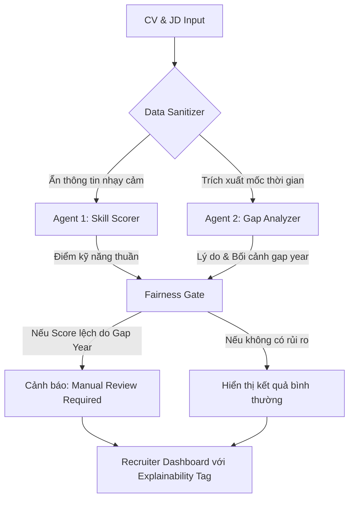

# Demo: Kiến trúc Xử lý Tuyển dụng Công bằng

Dưới đây là sơ đồ luồng dữ liệu (Data Flow) đảm bảo tính minh bạch.

---

### 1. Sơ đồ luồng (Mermaid Flowchart)

---

### 2. Mô tả các thành phần

#### A. Data Sanitizer
Lớp này có nhiệm vụ ẩn các thông tin dễ gây định kiến (Năm sinh, Địa chỉ cụ thể, Tên trường) trước khi gửi cho Agent chấm điểm kỹ năng. Điều này buộc Agent 1 phải đánh giá dựa trên "tài năng thực" (Blind audition pattern).

#### B. Agent 2: Gap Analyzer
Agent này chuyên trách việc giải mã các khoảng trống. Thay vì trừ điểm, nó tìm kiếm các hoạt động bù đắp (ví dụ: trong lúc nghỉ thai sản ứng viên vẫn thi chứng chỉ, hoặc sau khi nghỉ ứng viên quay lại làm dự án freelance).

#### C. Fairness Gate (Rule-based)
Nếu Agent 1 chấm điểm thấp cho một ứng viên mà Agent 2 nhận diện là có gap year thai sản, hệ thống sẽ tự động gán nhãn "Review needed" và yêu cầu con người xác nhận lại trước khi lưu kết quả.

---

### 3. Lợi ích kỹ thuật
- **Tính Module**: Dễ dàng cập nhật luật công bằng mà không cần train lại model.
- **Audit Trace**: Có thể truy xuất được vì sao một ứng viên bị đánh giá thấp (do kỹ năng hay do hệ thống phát hiện rủi ro).
